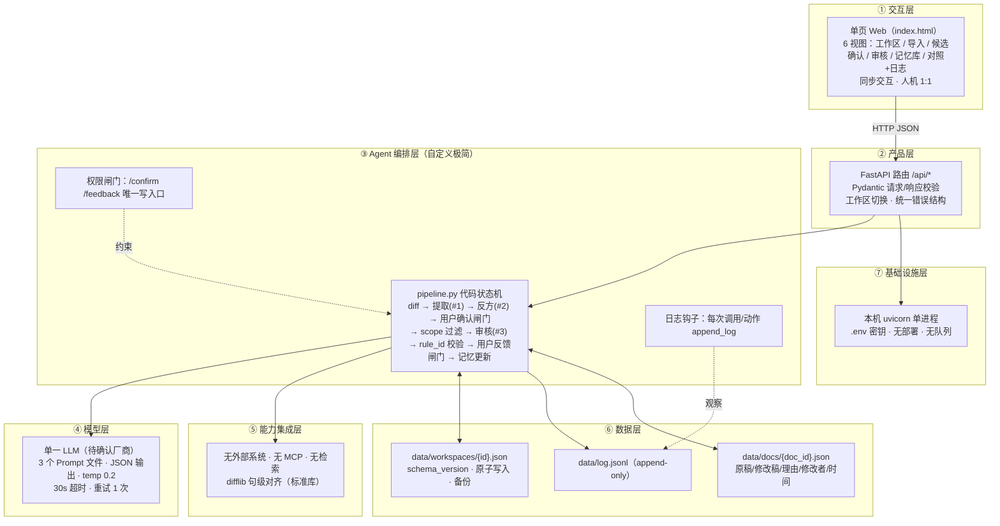

# 「分寸」Agent 架构与组件选型

> 生成日期：2026-09-12 · 阶段四产出 · 遵循《Agent 产品架构蓝图》五步 SOP
> 核心结论：**这是一个"代码状态机 + 3 类结构化模型调用 + 用户确认闸门"的产品，不是自主 Agent Loop，也不需要多 Agent。** 每个被引入的组件都回答了"没有它闭环会失去什么"。

---

## Step 1：需求拆解

| 维度 | 内容 | 状态 |
|------|------|------|
| **目标** | 让一位评审人对 AI 产品方案「指标与验收标准」的判断，经几次真实修改后沉淀为带条件、带来源、可推翻的审核记忆，并在下一份方案中逐句给出依据 | [已确认] |
| **可量化成功标准** | ① 同一新方案在两个工作区产生 ≥1 条不同结论；② 用户推翻一次判断后，规则版本 +1 且再审结果改变；③ 标记例外后，同类在范围内文档规则仍命中；④ 第 2 轮人工解释次数 < 第 1 轮（只报实际值）；⑤ 每条发现 100% 绑定存在的 rule_id 或被标记为通用建议 | [设计目标] |
| **用户** | 单用户（评审人本人）；人机比 1:1；同步交互；比赛期间 2 个工作区代表 2 位评审人 | [已确认] |
| **核心闭环** | 粘贴原稿+修改稿 → 系统提候选 → 用户确认 → 粘贴新方案 → 系统逐句审核 → 用户反馈 → 记忆更新 → 再审 | [已确认] |
| **交付物** | 结构化 findings（JSON）→ 四段式卡片；审核记忆（JSON 文件）；过程日志（JSONL） | [已确认] |
| **边界** | 不改写全文；不自动确认候选；不自动修改规则本体；不处理表格/图；不联网检索；不接外部系统 | [已确认] |
| **约束** | 一天半；非技术团队；单模型；本地运行；单次模型调用 ≤ 30s；比赛现场网络不确定 | [已确认 + 假设] |

## Step 2：Harness 五要素

| 要素 | 内容 | 实现形态 |
|------|------|---------|
| **工具** | `diff_sentences`（句级对齐）· `load_workspace` / `save_workspace`（原子读写）· `filter_rules_by_scope`（范围过滤）· `validate_rule_refs`（rule_id 校验）· `apply_feedback`（记忆更新）· `append_log`（日志）· `compute_metrics`（指标） | **全部是后端确定性函数，不暴露给模型选择**。模型不调用工具，代码调用模型 |
| **知识** | 已确认规则（按 scope 过滤后注入）· 当前 diff 片段 · 场景标签定义 · 判断类型定义（长期/项目/例外/不记录） | 注入 Prompt 的结构化 JSON；Prompt 模板独立文件 |
| **观察** | 模型输出结构合规率 · rule_id 无效引用数 · 每轮接受/拒绝/例外/调范围计数 · 人工解释次数 · 重复问题数 · 模型耗时 | JSONL 日志 + 指标端点 |
| **行动** | 提取候选 · 反方验证候选 · 审核新方案 | 3 类模型调用，每类一个 Prompt 文件 + 一个 Pydantic 输出 schema |
| **权限** | **必须用户确认**：候选 → 规则；规则范围变更；规则停用。**不得自动修改**：规则本体（例外只追加 exceptions[]）；历史版本；用户反馈记录。**模型不得**：写入记忆、决定 scope、删除任何东西 | 代码层闸门：`/confirm` 和 `/feedback` 是唯一写规则的入口，且只接受用户动作参数 |

## Step 3：组件选型（s01–s17 逐项判断）

| 组件 | 判断 | 理由（"没有它闭环会失去什么"） |
|------|------|------|
| s01 Agent Loop | **不使用**（作为自主循环） | 流程完全固定：diff → 提取 → 确认 → 审核 → 反馈。手册 9.3-[B]：固定流程用代码状态机。引入 loop 只会增加不确定性 |
| s02 Tool Use | **不使用**（模型侧工具调用） | 模型不需要选工具。后端函数由代码直接调用。若引入，模型可能"决定"跳过范围过滤——这正是要避免的 |
| s03 Permission | **使用其思想，自定义实现** | "候选必须经用户确认才成为规则"就是权限闸门。没有它，产品退化为"自动生成规则"，Q1 无法回答。实现为 API 层：写规则的端点只接受用户动作 |
| s04 Hooks | **使用其思想，简化实现** | 每次模型调用前后、每次用户动作后写日志。实现为一个 `@log_event` 装饰器 / 显式 `append_log()` 调用，不做通用 hook 注册表 |
| s05 TodoWrite | **不使用** | 无多步骤自主任务 |
| s06 Subagent | **不使用**（但"反方验证"调用借用其上下文隔离思想） | 反方验证是一次独立的模型调用，输入只有候选判断 + diff，不带提取调用的对话历史，避免模型自我确认。这是"独立调用"不是"子 Agent"——没有嵌套循环 |
| s07 Skill Loading | **不使用** | 领域知识 = 规则 JSON，按 scope 过滤后全量注入，数量 < 50，无需惰性加载 |
| s08 Context Compact | **不使用** | 单次调用上下文 < 8k tokens |
| s09 Memory | **不使用其实现，自定义领域记忆** | s09 是通用的 `.memory/*.md` 偏好记忆。本项目的"审核记忆"是强结构化的领域对象（rule_id、scope、exceptions、versions），需要确定性过滤和版本控制，Markdown 记忆无法满足。**这是产品的核心资产，必须自定义** |
| s10 Task System | **不使用** | 无持久化任务图需求 |
| s11 Background Tasks | **不使用** | 单次调用 ≤ 30s，同步即可。若冒烟超 20s 改为"提交+轮询"（仍不引入线程池，用简单状态文件） |
| s12 Cron | **不使用** | 无定时需求 |
| s13 Agent Teams | **不使用** | 无并行任务、无工作区隔离需求、无可见协作价值。新提示词明确：只有真实并行/隔离/协作价值时才引入 |
| s14 MCP | **不使用** | 无外部工具生态接入 |
| s15 Integrated Harness | **不使用** | 没有多机制需要协同 |
| s16 Workflow Runtime | **使用其思想，极简实现** | "编排形态固定"正是本项目特征。但不引入 journal/续跑/并发原语，实现为 `services/pipeline.py` 中的 3 个顺序函数 + 文件持久化的中间状态 |
| s17 Goal Loop | **不使用** | "何时算完成"由用户点击决定 |

**小结：** 0 个组件原样使用；3 个借思想自定义（权限闸门、日志钩子、固定流水线）；1 个必须自定义（领域记忆）；13 个明确不用。

### 多 Agent 角色逐一判断

新提示词列出 6 个候选角色，逐一回答"是否真的需要"：

| 角色 | 是否需要 | 结论与形态 |
|------|---------|-----------|
| 判断提取 Agent | **需要，作为模型调用 #1** | 输入 diff 片段 + 场景标签 → 输出 ≤3 条候选，每条含 2 个互斥解释 + 反例预演 + 建议 scope + 来源句 ID。这是唯一不可替代的模型能力 |
| 反方验证 Agent | **需要，作为模型调用 #2，可降级** | 独立上下文，输入候选 + diff → 输出：是否过度泛化、更窄的替代表述、若采用会误伤的例句。**没有它**：候选的两个解释可能都是模型自我确认的产物，"学条件不学禁词"的证据减弱。**降级**：若时间不够，把反方检查合并进调用 #1 的 Prompt（要求自我反驳），损失独立性但保留功能 |
| 范围与例外 Agent | **不需要 Agent，用代码** | scope 过滤和例外隔离必须是确定性的，否则无法向评委证明"例外不污染标准"。模型只在调用 #1 中"建议" scope，最终由用户选 |
| 审核执行 Agent | **需要，作为模型调用 #3** | 输入新方案句列表 + 过滤后规则 → 输出 findings，每条必须引用 rule_id。这是第二个不可替代的模型能力 |
| 证据与日志 Agent | **不需要 Agent，用代码** | rule_id 存在性校验、evidence 拼装、日志写入全是确定性操作。用模型做这件事会引入幻觉 |
| 汇总 Agent | **不需要 Agent，用代码** | findings 已是结构化 schema，前端直接渲染。无自然语言拼接 |

**多 Agent 结论：** 三次模型调用按固定顺序执行，每次输出经 Pydantic schema 校验后由代码汇总。**不是多 Agent 系统**，答辩中如实这样说——"我们有三个职责清晰的模型调用和一套确定性的记忆逻辑，没有为了显得先进而拆 Agent"。失败降级路径：调用 #2 可关闭；调用 #1 失败可人工新建规则；调用 #3 失败返回统一错误可重试。

## Step 4：架构方案

### 4.1 七层架构与数据流



**一条贯穿数据流（审核一份新方案）：**
用户在 UI 粘贴新方案 + 选场景标签 → `/api/review` 校验请求 → `pipeline.review()`：① 按句切分并编号；② `filter_rules_by_scope(workspace, scene)` 返回 active 且 scope 匹配的规则（**代码**）；③ 组装 Prompt #3，调用模型；④ 宽容解析 JSON → Pydantic `ReviewOutput` 校验，失败重试 1 次；⑤ `validate_rule_refs()`：引用不存在或非 active 的 rule_id 的 finding 降级为 `kind="generic"`（**代码**）；⑥ 为每条 finding 拼装 `evidence`（从规则的 `evidence[]` 取 before/after 原文，**代码**）；⑦ 保存 `review_run` 到工作区文件（状态 `awaiting_feedback`）；⑧ `append_log("review.completed", {...})`；⑨ 返回 findings + "加载 N 条 / 跳过 M 条" → UI 渲染四段式卡片。

### 4.2 状态机

**文档（DocPair）**
```
imported → diffed → candidates_proposed → candidates_resolved
                                  ↓（模型失败）
                            extraction_failed → （用户手动新建规则）→ candidates_resolved
```

**规则（Rule）**
```
candidate ──确认"长期"──→ confirmed(active, v1)
          ──确认"仅当前项目"──→ project(active, 仅 project_id 匹配时加载)
          ──确认"这次例外"──→ 不创建规则，只在 DocPair 上记 note
          ──确认"暂不记录"──→ discarded（保留记录，不加载）

confirmed(vN) ──拒绝:判断本身错──→ confirmed(vN+1)，history 追加 vN
confirmed(vN) ──拒绝/调整:范围不对──→ confirmed(vN+1, scope 变更)
confirmed(vN) ──例外──→ confirmed(vN) 不变，exceptions[] +1
confirmed(vN) ──同 scene 例外 ≥2──→ 生成 scope_change_proposal（候选，需确认）
confirmed(vN) ──用户停用──→ inactive（不删除）
```

**审核运行（ReviewRun）**
```
created → rules_filtered → reviewing → findings_ready → awaiting_feedback → closed
                                 ↓（模型失败×2）
                           review_failed（可重试）
```

**发现（Finding）**
```
open → accepted | rejected(reason ∈ {判断本身错, 范围不对, 这次特殊}) | exception | scope_adjusted
```

### 4.3 数据模型（`schema_version: 1`）

```jsonc
// data/workspaces/{workspace_id}.json
{
  "schema_version": 1,
  "workspace_id": "reviewer_A",
  "display_name": "评审人 A",
  "created_at": "...",
  "rules": [ /* Rule[] 见下 */ ],
  "doc_pairs": [ /* DocPairRef[]：doc_id, scene, imported_at, status */ ],
  "review_runs": [ /* ReviewRun[] */ ]
}

// Rule
{
  "rule_id": "R-A-003",              // 前缀含工作区，跨工作区不可能撞号
  "version": 2,
  "status": "confirmed",             // candidate|confirmed|project|discarded|inactive
  "statement": "上线前 PRD 中的效果指标必须附基线值与测量方法",
  "intent": "避免无法验收的效果承诺",             // 用户在候选阶段选中的解释
  "rejected_intent": "不允许出现整数百分比目标",  // 未选中的解释，作过程记录
  "trigger": {
    "description": "出现准确率/召回率/效率等量化目标，且句内无基线值或测量方法",
    "positive_examples": ["模型准确率提升至 95%"],
    "negative_examples": ["在 2025Q3 测试集上准确率从 87% 提升至 95%，算法组每周测量"]
  },
  "scope": { "applies_to": ["上线前PRD"], "excludes": ["探索期方案"] },
  "project_id": null,                // status=project 时必填
  "evidence": [
    { "doc_id": "D-A-001", "sentence_id": 4,
      "before": "模型准确率提升至 95%",
      "after": "在 2025Q3 标注测试集上，准确率从 87% 提升至 95%，算法组每周测量",
      "reviewer_note": "没基线没法验收", "reviewer": "队员B", "at": "..." }
  ],
  "confirmation": { "by": "user", "at": "...", "choice": "long_term" },
  "exceptions": [
    { "run_id": "RR-A-002", "finding_id": "F-07", "scene": "探索期方案",
      "sentence": "用户满意度显著提升", "at": "...", "promoted": false }
  ],
  "feedback_log": [ { "run_id": "...", "finding_id": "...", "action": "accept", "at": "..." } ],
  "stats": { "applied": 4, "accepted": 3, "rejected": 0, "exceptions": 1 },
  "history": [
    { "version": 1, "statement": "指标中不允许出现百分比目标", "scope": {...},
      "changed_at": "...", "reason": "用户拒绝 F-02，选择'判断本身错'：反对的是无基线的百分比，不是所有百分比" }
  ],
  "created_at": "...", "updated_at": "..."
}

// data/docs/{doc_id}.json  —— 原始输入，永不修改
{
  "schema_version": 1, "doc_id": "D-A-001", "workspace_id": "reviewer_A",
  "scene": "上线前PRD", "title": "智能客服意图识别 PRD-指标章节",
  "original": "...", "revised": "...",
  "reviewer": "队员B", "author": "队员A",
  "change_notes": [ { "sentence_id": 4, "note": "没基线没法验收" } ],
  "imported_at": "...", "data_origin": "live"     // live | preset | aux —— 三类数据必须标记
}

// ReviewRun
{
  "run_id": "RR-A-002", "workspace_id": "reviewer_A", "scene": "上线前PRD",
  "input_text": "...", "sentences": [ {"id": 1, "text": "..."} ],
  "rules_loaded": ["R-A-001","R-A-003"], "rules_skipped": [{"rule_id":"R-A-002","why":"scope"}],
  "findings": [
    { "finding_id": "F-04", "sentence_id": 3, "kind": "memory",   // memory | generic
      "rule_id": "R-A-003", "rule_version": 2,
      "problem": "该指标缺少基线与测量方法", "suggestion": "补充基线值与测量周期/负责方",
      "evidence_ref": { "doc_id": "D-A-001", "sentence_id": 4 },
      "status": "open", "feedback": null }
  ],
  "metrics": { "findings": 5, "memory_findings": 4, "generic": 1, "accepted": 0, "rejected": 0,
               "exceptions": 0, "scope_adjusted": 0, "manual_explanations": 0, "invalid_rule_refs": 0 },
  "model_meta": { "model": "...", "latency_ms": 0, "retries": 0 },
  "status": "awaiting_feedback", "created_at": "...", "data_origin": "live"
}
```

**日志事件（`data/log.jsonl`，每行一个）**
```jsonc
{ "ts": "...", "event": "rule.version_bumped", "workspace_id": "reviewer_A",
  "payload": { "rule_id": "R-A-003", "from": 1, "to": 2, "reason": "..." } }
```
事件类型：`doc.imported` · `extract.called/succeeded/failed` · `counter.called/...` · `candidate.resolved` · `review.called/succeeded/failed` · `finding.feedback` · `rule.version_bumped` · `rule.exception_added` · `rule.scope_change_proposed` · `rule.deactivated` · `manual.explanation`（用户改写解释/手动建规则）

### 4.4 规则版本模型

- 规则本体（statement / trigger / scope）任何变更 → `version += 1`，旧版完整快照进 `history[]`，附 `reason` 和触发的 `finding_id`。
- 例外 → **不改 version**，只追加 `exceptions[]`。
- 同一 `scene` 的例外累计 ≥2 → 生成 `scope_change_proposal`（作为新候选进入确认页），用户确认后才 version +1。
- 拒绝 ≠ 删除：`inactive` 是唯一"停用"状态，保留全部字段。
- findings 记录 `rule_version`，保证"当时是按哪版规则判的"可追溯。
- 审核时只加载 `status ∈ {confirmed, project(匹配 project_id)}` 且 `scope.applies_to ∋ scene` 且 `scene ∉ scope.excludes`。

### 4.5 API / 工具清单

| 方法 路径 | 输入 | 输出 | 副作用 | 调模型 |
|-----------|------|------|--------|--------|
| `GET /api/workspaces` | — | 工作区列表 | 无 | 否 |
| `POST /api/workspaces/{ws}/docs` | original, revised, scene, reviewer, author, change_notes[], data_origin | doc_id, diff[] | 写 docs/、log | 否 |
| `POST /api/workspaces/{ws}/docs/{doc}/extract` | — | candidates[]（含 explanations[2], preview, suggested_scope, evidence） | 写 workspace（候选）、log | **#1 提取 + #2 反方** |
| `POST /api/workspaces/{ws}/candidates/{cid}/resolve` | choice ∈ {long_term, project, exception, discard}, chosen_explanation_idx, scope, project_id? | Rule | 写 workspace、log | 否 |
| `POST /api/workspaces/{ws}/rules` | 手动新建规则全字段 | Rule | 写 workspace、log(manual.explanation) | 否 |
| `POST /api/workspaces/{ws}/review` | text, scene, project_id?, data_origin | ReviewRun（findings, rules_loaded, rules_skipped, metrics） | 写 workspace、log | **#3 审核** |
| `POST /api/workspaces/{ws}/runs/{run}/findings/{fid}/feedback` | action ∈ {accept, reject, exception, adjust_scope}, reject_reason?, new_scope? | 更新后的 Rule + Finding | 写 workspace、log；可能 version+1 / exceptions+1 / proposal | 否 |
| `GET /api/workspaces/{ws}/rules` | — | Rule[]（含 history） | 无 | 否 |
| `GET /api/workspaces/{ws}/runs` | — | ReviewRun[]（含 metrics） | 无 | 否 |
| `GET /api/compare?text=&scene=` | text, scene | 两个工作区各一份 ReviewRun | 写 log；**不写入工作区**（对照运行不产生反馈） | **#3 ×2** |
| `GET /api/log?ws=` | — | 事件列表 | 无 | 否 |
| `GET /api/metrics/{ws}` | — | 逐轮指标表 | 无 | 否 |

统一错误：`{"error": {"code": "MODEL_TIMEOUT" | "MODEL_OUTPUT_INVALID" | "NOT_FOUND" | "VALIDATION" | "IO", "message": "..."}}`

### 4.6 模型调用边界

| 调用 | 输入（只有这些） | 输出 schema（Pydantic） | 模型**不可以**做 |
|------|----------------|----------------------|----------------|
| #1 提取 | scene；diff 片段列表（sentence_id, before, after, reviewer_note?）；判断类型定义 | `ExtractOutput{candidates: List[Candidate{statement, explanations[2]{text, would_flag[], would_pass[]}, suggested_scope, evidence_sentence_ids[]}]}`，≤3 条 | 决定规则是否长期；写入记忆；引用不在 diff 中的句子 |
| #2 反方 | 单条候选 + 对应 diff 片段（**不带 #1 对话历史**） | `CounterOutput{overgeneralized: bool, narrower_statement?: str, false_positive_examples[]}` | 修改候选；决定采纳 |
| #3 审核 | scene；句列表；**已过滤**的规则列表（rule_id, version, statement, trigger, negative_examples） | `ReviewOutput{findings: List[{sentence_id, rule_id?, problem, suggestion}]}` | 引用未提供的 rule_id（代码会降级）；判断范围（已由代码过滤）；给出"通用建议"以外没有 rule_id 的"记忆发现" |

Prompt 均含正反例；解析器宽容（去 code fence、修剪前后文、容忍尾逗号）；数量超限（>3 候选）截断并记质量瑕疵，不算解析失败。

### 4.7 失败降级路径

| 失败 | 处理 | 用户看到 |
|------|------|---------|
| 模型超时 / 网络错 | 重试 1 次；仍失败返回 `MODEL_TIMEOUT` | "模型暂时不可用，可重试"；已保存的状态不丢 |
| #1 输出不合法 ×2 | 返回 `MODEL_OUTPUT_INVALID`；DocPair 状态 `extraction_failed` | "未能自动提取候选，你可以手动新建规则" → 记 `manual.explanation` |
| #2 失败 | **静默降级**：候选保留 #1 的两个解释，标记 `counter_checked: false` | 候选卡片少一行"反方检查" |
| #3 输出不合法 ×2 | 返回 `MODEL_OUTPUT_INVALID`，run 状态 `review_failed` | "审核失败，可重试" |
| #3 引用无效 rule_id | 该 finding 降级为 `generic`，计入 `invalid_rule_refs` | 灰色"通用建议"标签 |
| 文件写入失败 | 原子写入失败不覆盖原文件；返回 `IO` | "保存失败，请重试" |
| 现场完全无网 | 播放赛前录屏，开头明示 | — |

### 4.8 可观测性与审计日志

- 每次模型调用记录：调用类型、模型名、耗时、重试次数、输出是否首次合规、token 用量（如 SDK 提供）；**不记 Prompt 全文、不记密钥、不记方案原文（只记句 ID 与前 20 字）**。
- 每次用户动作记录：动作、目标对象、前后状态摘要。
- 逐轮指标由 `compute_metrics(workspace)` 从 review_runs 确定性计算，不另存副本，避免不一致。
- `GET /api/log` 提供时间线，直接作为"过程记录 25%"证据。

### 4.9 安全与密钥

- `.env`：`MODEL_PROVIDER`, `MODEL_NAME`, `MODEL_API_KEY`, `MODEL_BASE_URL`, `MODEL_TIMEOUT_S=30`；`.env.example` 不含真实值；`.gitignore` 含 `.env`, `data/`, `.venv/`。
- 前端无任何密钥；前端只调 `/api/*`。
- 输入文本长度上限 8000 字符；句数上限 60；超限返回 `VALIDATION`。
- 不删除任何数据：无 DELETE 端点；`inactive` 代替删除。
- 待审核文本会发送到模型厂商——需产品经理确认（见适配声明第 6 节）。

## Step 5：代码计划（概要，详见《分阶段开发计划》）

1. 可运行骨架：FastAPI + 静态页 + 工作区读写 + 健康检查
2. 核心闭环：导入 → diff → 提取(#1) → 确认 → 审核(#3) → 校验 → 展示
3. 规则和反馈持久化：四类反馈 → 版本 / 例外 / 提案；日志；指标
4. 增强：反方验证(#2)；对照视图；scope 变更提案
5. 前端交互：6 视图状态完善、loading/empty/failed、四段式卡片、指标条
6. 测试与 Demo 数据：pytest 全覆盖 + 真实冒烟 + 现场数据生成流程
7. 演示验收：排练、录屏、检查表

---

## 系统提示词草案（蓝图 Step 4 要求）

**#1 提取**
> 你是一位资深 AI 产品评审人的助手。给你一份「指标与验收标准」章节的原稿与修改稿的句级差异，以及文档场景标签。你的任务是：提出**至多 3 条**可能的评审判断，每条判断给出**两个互斥的解释**（例如"要求指标有基线"vs"不允许百分比"），并为每个解释写出：如果采用它，下面哪类句子会被标记、哪类会通过（各 1 例）。你只能引用差异中存在的句子 ID 作为来源。你**不能**决定判断是否长期适用——这由用户决定。输出严格 JSON（schema 见下），禁止 Markdown 代码块外的任何文字。正例：{…}；反例（禁止）：解释含糊如"表达更规范"、两个解释不互斥、引用不存在的句子。

**#2 反方**
> 你是一位苛刻的审稿人。给你一条候选评审判断和它所依据的修改。判断它是否**过度泛化**（把一次具体修改推广成了过宽的规则）。如果是，给出一个更窄的表述，并列出若采用原候选会被误伤的 1–2 个例句。输出严格 JSON。

**#3 审核**
> 你是评审人的执行助手。给你一份新方案的句列表和一组**已由评审人确认**的规则（含 rule_id、版本、表述、触发条件、不应命中的反例）。逐句检查，只在句子**明确**触发某条规则时输出一条发现，并**必须**填写该规则的 rule_id。不要发明规则；不要引用列表之外的 rule_id。如果你发现规则之外的严重问题，可以输出 rule_id 为空的"通用建议"，但要少。每条发现给出：问题（一句话）与可执行建议（一句话，指向补什么而不是删掉）。输出严格 JSON。反例（禁止）：把反例句标记为问题；为同一句输出重复发现。
